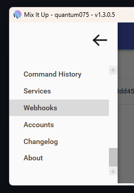
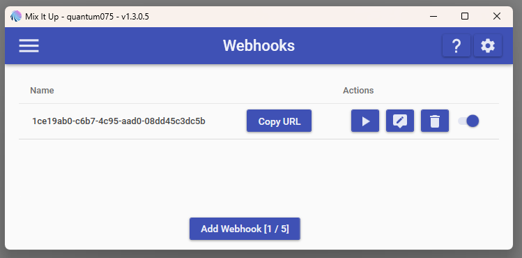
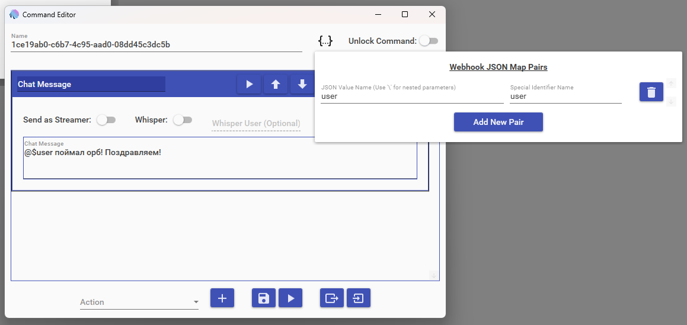
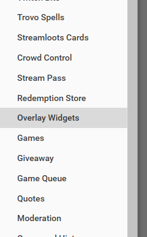
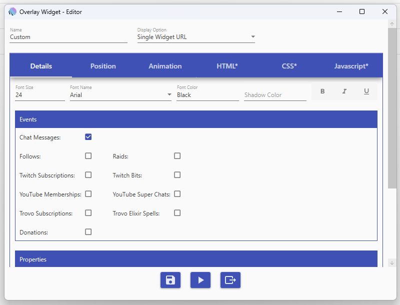
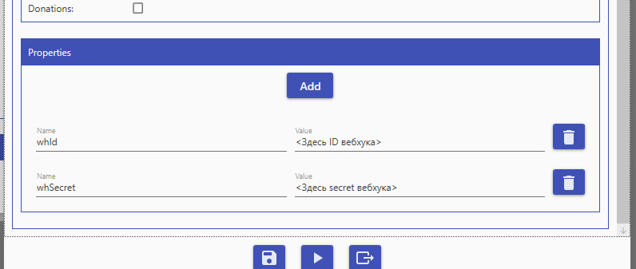
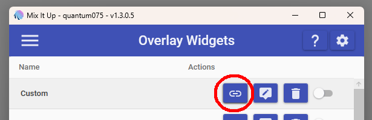
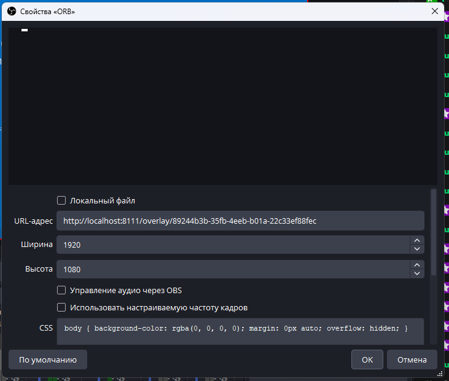

# Twitch Orb Overlay

Данный репозиторий представляет из себя оверлей для твича, подключаемый через [MixItUp](https://github.com/SaviorXTanren/mixer-mixitup) сделанный для [SillySnaily](https://www.twitch.tv/sillysnaily).

Оверлей добавляет Орб (он же "призрачный огонёк") из Phasmophobia, появляющийся на стриме с некоторой периодичностью.
Когда появляется орб, пользователи в чате могут использовать команду `!орб` или `!orb`, для того, чтобы поймать его.
Для того, чтобы вручную вызвать появление орба, можно использовать команду `!чопоорбам`.

## Логика работы

В **MixItUp** создаётся кастомный виджет с возможностью получения сообщений из чата.

Внутри него с помощью JS создаётся объект орба, который с некоторой периодичностью появляется и летает по экрану.

Если виджет ловит событие сообщения во время активности орба - скрипт завершает его цикл и отправляет **HTTP POST** запрос в **API MixItUp** с указанными *ID* и *Secret*.

**WebHook MixItUp** передаёт приложению событие о том, что орб был пойман, передавая туда значение `user` - пользователь, который поймал орб.

Пользователь может самостоятельно настроить обработку, указав желаемое сообщение или настроив любые другие действия.

## Подключение

Переходим в раздел **Webhooks**.

Создаём вебхук.

В вебхуке прописываем `user`: `user` в *Webhook JSON Map Pairs* и добавляем **Action** вызываемый когда пользователь ловит орб. В экшне появится параметр `user`, который можно использовать, чтоб, например, выдать сообщение, кто поймал орб.

Сохраняем, жмём *Copy URL*, из URL вытаскиваем 2 значения:
- **ID вебкуха** - значение вида `XXXXXXXX-XXXX-XXXX-XXXX-XXXXXXXXXXXX`;
- **Secret вебхука** - цифробуквенное значение идущее после `secret=` в URL'е;
Эти два значения пригодятся нам позже.

Переходим в раздел **Overlay Widgets**.

Создаём виджет.
- `Display Option` указываем `Sindle Widget URL`;
- В *Details* -> *Events* ставим галочку `Chat Messages`;
- Переходим в **HTML**, удаляем всё что там есть;
- Переходим в **CSS**, вставляем туда код [отсюда](orb.css);
- Переходим в **JavaScript**, вставляем туда код [отсюда](orb.js);

Возвращаемся в **Details**. В **Properties** добавляем 2 параметра:
- `whId` - сюда вставляем значение ***ID вебхука***, вырезанное ранее из URL'а вебхука;
- `whSecret` - сюда вставляем значение ***секрета вебхука***, вырезанное оттуда же;

Копируем ссылку на созданный **Overlay Widget**.

Вставляем полученную ссылку в OBS как **браузерный источник**.

Готово! Вы восхитительны!
